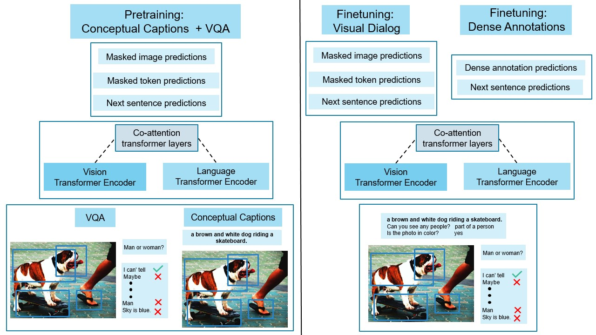

## VisDial-BERT ##

PyTorch implementation for the paper:

**[Large-scale Pretraining for Visual Dialog: A Simple State-of-the-Art Baseline]()**  
Vishvak Murahari, Dhruv Batra, Devi Parikh, Abhishek Das  

Prior work in visual dialog has focused on training deep neural models on the VisDial dataset in isolation, which has led to great progress, but is limiting and wasteful. In this work, following recent trends in representation learning for language, we introduce an approach to leverage pretraining on related large-scale vision-language datasets before transferring to visual dialog. Specifically, we adapt the recently proposed [ViLBERT][vilbert] model for multi-turn visually-grounded conversation sequences. Our model is pretrained on the Conceptual Captions and Visual Question Answering datasets, and finetuned on VisDial with a VisDial-specific input representation and the masked language modeling and next sentence prediction objectives (as in BERT). Our best single model achieves state-of-the-art on Visual Dialog, outperforming prior published work (including model ensembles) by more than 1% absolute on NDCG and MRR.



This repository contains code for reproducing results with and without finetuning on dense annotations. All results are on [v1.0 of the Visual Dialog dataset][visdial-data]. We provide pretrained model weights and associated configs to run inference or train these models from scratch.

If you find this work useful in your research, please cite:

```
@article{visdial_bert
  title={Large-scale Pretraining for Visual Dialog: A Simple State-of-the-Art Baseline},
  author={Vishvak Murahari and Dhruv Batra and Devi Parikh and Abhishek Das},
  journal={arXiv preprint arXiv:1912},
  year={2019},
}
```


### Table of Contents

   * [Setup and Dependencies](#setup-and-dependencies)
   * [Usage](#usage)
      * [Download preprocessed data](#download-preprocessed-data)
      * [Pre-trained checkpoints](#pre-trained-checkpoints)
      * [Training](#training)
      * [Logging](#logging)
      * [Evaluation](#evaluation)
      * [Visualizing Results](#visualizing-results)
   * [Reference](#reference)
   * [License](#license)

### Setup and Dependencies

Our code is implemented in PyTorch (v1.0). To setup, do the following:

1. Install [Python 3.6](https://www.python.org/downloads/release/python-365/)
2. Get the source:
```
git clone https://github.com/vmurahari3/visdial-bert.git visdial-bert
```
3. Install requirements into the `visdial-bert` virtual environment, using [Anaconda](https://anaconda.org/anaconda/python):
```
conda env create -f env.yml
```

### Usage

Make both the scripts in `scripts/` executable

```
chmod +x scripts/download_preprocessed.sh
chmod +x scripts/download_checkpoints.sh
```

#### Download preprocessed data

Download preprocessed dataset and extracted features:

```
sh scripts/download_preprocessed.sh
```

To get these files from scratch:
```
python preprocessing/pre_process_visdial.py 
```

However, we recommend downloading these files directly.

#### Pre-trained checkpoints

Download pre-trained checkpoints:

```
sh scripts/download_checkpoints.sh
```

#### Training

After running the above scripts, all the pre-processed data is downloaded to `data/visdial` and the major pre-trained model checkpoints used in the paper are downloaded to `checkpoints-release`

Here we list the training arguments to train the important variants in the paper.

To train the base model (no finetuning on dense annotations):

```
python train.py -batch_size 80  -batch_multiply 1 -lr 2e-5 -image_lr 2e-5 -mask_prob 0.1 -sequences_per_image 2 -start_path checkpoints-release/vqa_pretrained_weights
```

To finetune the base model with dense annotations:

```
python dense_annotation_finetuning.py -batch_size 80 -batch_multiply 10  -lr 1e-4 -image_lr 1e-4 -nsp_loss_coeff 0 -mask_prob 0.1 -sequences_per_image 2 -start_path checkpoints-release/basemodel
```

To finetune the base model with dense annotations and the next sentence prediction (NSP) loss:

```
python dense_annotation_finetuning.py -batch_size 80 -batch_multiply 10  -lr 1e-4 -image_lr 1e-4 -nsp_loss_coeff 1 -mask_prob 0.1 -sequences_per_image 2 -start_path checkpoints-release/basemodel
```

NOTE: Dense annotation finetuning is currently only supported for 8-GPU training. This is primarily due to memory issues. To calculate the cross entropy loss over the 100 options at a dialog round, we need to have all the 100 dialog sequences in memory. However, we can only fit 80 sequences on 8 GPUs with ~12 GB RAM and we only select 80 options. Performance gets worse with fewer GPUs as we need to further cut down on the number of answer options.

#### Evaluation
The below code snippet generates a prediction file which can be submitted to the [test server](https://evalai.cloudcv.org/web/challenges/challenge-page/161/leaderboard) to get results on the test split. 

```
python evaluate.py -n_gpus 8 -start_path <path to model> -save_name <name of model>
```

#### Logging

We use [Visdom](https://github.com/facebookresearch/visdom) for all logging. Specify `visdom_server`, `visdom_port` and `enable_visdom` arguments in options.py to use this feature. 

#### Visualizing Results

Coming soon

### Acknowledgements

Builds on Jiasen Lu's ViLBERT [implementation](https://github.com/jiasenlu/vilbert_beta).

### License

BSD

[vilbert]: https://arxiv.org/abs/1908.02265
[visdial-data]: https://visualdialog.org/data
